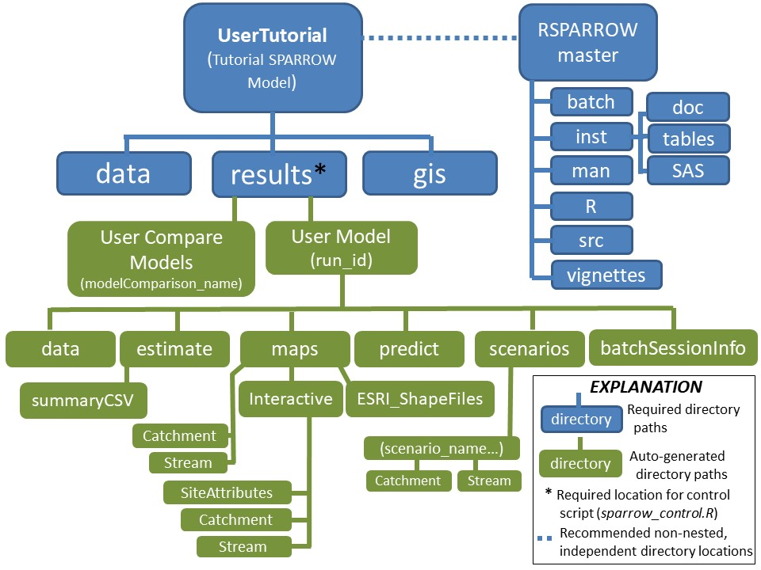

RSPARROW (Version >=1.1.0)
----------

RSPARROW is a system of R scripts and functions for executing and evaluating SPARROW models that generates graphical, map, and tabular output. Users operate the system within RStudio from a single control script that accesses the supporting input files and functions. Only minimal knowledge of R is required to use the system.

[SPARROW (SPAtially Referenced Regressions on Watershed attributes)](https://pubs.usgs.gov/fs/2009/3019/pdf/fs_2009_3019.pdf) is a spatially explicit, hybrid (statistical and mechanistic) water-quality model developed by the USGS. The model has been used to quantify the sources and transport of contaminants in watersheds of widely varying sizes, from catchment to continental scales. SPARROW includes three major process components that explain spatial variability in stream water quality:  (1) contaminant source generation, (2) land-to-water delivery, and (3) stream and reservoir transport and decay. The non-linear and mechanistic structure of the model includes mass balance constraints and non-conservative transport components. This includes factors that control the attenuation and delivery of contaminants to streams via surficial and subsurface pathways and the removal of contaminants in streams and reservoirs, according to first-order decay kinetics. SPARROW is structured as a network of one-dimensional stream segments and their contributing drainage areas. 

The [RSPARROW documentation](https://code.usgs.gov/water/stats/RSPARROW/blob/master/RSPARROW_master/inst/doc/RSPARROW_docV1.1.0.pdf) describes the steps necessary to estimate the static version of the model. The static model provides reach-level predictions (and uncertainties) of the long-term mean annual water-quality loads, yields, and flow-weighted concentrations. The predictions also include the shares of the load attributable to individual upstream sources and predictions of the mass quantities of the total load and individual sources that are delivered to downstream water bodies.

### Features 

* An R Shiny interactive Decision Support System (DSS) allows users to map SPARROW model predictions and geographic data by stream reach, catchment, and monitoring site location and to evaluate the effects of hypothetical changes in contaminant source inputs on downstream water-quality loads and concentrations. The mapper operates within a user-specified Web browser (see sidebar example), with options to display standardized, globally available base maps (e.g., topography, land use, street maps). A batch-mode option supports production of multiple maps in a single execution for model applications to large watersheds that require longer execution times. The DSS executes source-change scenarios for user-defined watershed and reach locations, source types, and change magnitudes, with the water-quality effects reported in tabular and mapped output. Scenarios are applicable to modeled sources with inputs expressed in units of mass (e.g., fertilizers) or area (land use/cover).

* Diagnostic metrics and interactive plots and maps, with user-controlled options, enable efficient evaluations of model performance and production of map output for explanatory and response data and model prediction metrics by monitoring sites, stream reaches and catchments. These capabilities are enhanced by use of a data dictionary as a master respository of the system and user-defined variable names and attributes. Users also have the option to sequester monitoring (validation) sites to independently assess model performance.

* R functions and scripts, coded according to standardized open-source R protocols, promote work environment efficiencies that encourage the collaborative development of sharable SPARROW methods and functions. Use of the USGS GitLab and GitHub repositories ensures standardized methods of storage, maintenance, documentation, and retrieval of R functions and control scripts. A description of the RSPARROW design elements (Chapter 7 of the documentation) provides an informative guide for experienced R users and developers. Custom string search tools are also provided to developers to ensure that functional dependencies and variable attributes can be readily identified in the RSPARROW library to support the collaborative development of the software.

These features extend the capabilities provided in the [SAS SPARROW](https://pubs.usgs.gov/tm/2006/tm6b3/) software. 

### System Requirements 

RSPARROW requires a 64-bit processor on a Windows platform. A minimum of 4GB of RAM or larger is highly recommended. Users may find that 8GB or more of RAM is necessary to obtain acceptable performance when using the R Shiny interactive mapper and for model execution with large watersheds (e.g., more than 300,000 reaches). An installation of RStudio is the required interface for using RSPARROW. The software has not been tested on MAC and Unix platforms (note that two features of the current software version have Windows dependencies: the automated pop-up of CSV control files and the batch-mode operation). Our evaluations indicated that the R Shiny interactive mapper performed more reliably using Chrome, Microsoft Edge, and Firefox Web browsers as compared with that for Internet Explorer.

### Software Installation and Directory Structure

**Download RSPARROW from the USGS GitLab repository:**  <https://code.usgs.gov/water/stats/RSPARROW>. 

This includes scripts, functions, and supporting documentation and tutorials. Two directories contain the contents of RSPARROW (The figure below shows the contents of the RSPARROW directories as installed on a user's computer):

1. **RSPARROW_master**:  Includes functions, sourced files (DLLs), meta-data, and documentation vignettes. The directory contents should not be modified by users; no other sub-directories should be created in this directory on a user's computer. **The documentation, with clickable links in the PDF table of contents, is located in the ["RSPARROW_master/inst/doc"](https://code.usgs.gov/water/stats/RSPARROW/blob/master/RSPARROW_master/inst/doc/RSPARROW_docV1.0.pdf) sub-directory.**  

2. **UserTutorial**:  Contains the SPARROW total nitrogen models that are used for the tutorials presented in Chapter 6 of the documentation. 

    * The *"results"* sub-directory contains a control script, input control files to execute the SPARROW model, and sub-directories for the tutorial models. The control script executes a predetermined sequence of function calls, governed by user settings in the control script (see the *executionTree* section of Chapter 7 for a list of functions). **Once the RSPARROW directories and required software are installed (see below), users can begin by running the control script in RStudio (without any edits), which will execute the final SPARROW tutorial model 6 (with results written to the "Model6_User" directory) and enable the RShiny DSS.  To verify the software installation and model execution, users can compare the results with those provided in the "Model6" directory. **
    
    * The directory structure and contents for the tutorial model, including the control script and input control files, can be used as a template to guide the setup and execution of user-developed models. 
    
    * Separate execution of RSPARROW library functions by users (e.g., to estimate models or generate predictions and maps) is not supported; however, the R Shiny interactive mapper can be independently enabled for any previously executed model within an RStudio session (see Chapter sub-section 4.4.9.1.2).

**Download of the required R software**

RSPARROW 1.1.0 was tested for compatibility with versions of R, RStudio, and the required R library functions available at the time of public release (November 2020): These include R-4.0.3, RStudio 1.3.959, and the required versions of R library dependencies that are listed in the DESCRIPTION file. RSPARROW may operate with more current versions of the software, but full compatibility of RSPARROW with newer versions is not guaranteed. 

The required software can be obtained as follows: 

* *R:* The current and past versions are available from the Cran server at *https://cran.r-project.org/bin/windows/base/old/*. We recommend installation of the R directory in a location on your PC that does not require Administrator rights. 

* *RStudio:* The most current version is available at *https://rstudio.com/products/rstudio/download/*, with older versions available at *https://rstudio.com/products/rstudio/older-versions/*. 

* *R library dependencies:* Execution of the RSPARROW control script automatically installs the most recent versions of the required R library packages and functions in the user's default R library as specified in RStudio (see Chapter 1 of the documentation for information on the installation of RSPARROW library dependencies and instructions for setting RStudio defaults).  

### Reporting bugs

Please consider reporting bugs and asking questions on the GitHub Issues page: <https://github.com/USGS-R/RSPARROW/issues>.

Follow `@USGS_R` on Twitter for updates on USGS R packages:

### Package Support

Resources are available primarily for maintenance and responding to user questions. Priorities on the development of new features are determined by the `RSPARROW` development team.

Funding for the production of RSPARROW was provided by the National Water Quality Assessment Project of the USGS National Water Quality Program, with additional support provided by the Integrated Modeling and Prediction Division (IMPD) of the USGS Water Mission Area and the USGS Maryland-Delaware-DC Water Science Center. Funding was also provided by the National Water Agency of Brazil (ANA) and the Geological Survey of Brazil (CPRM) as part of a [collaborative agreement](https://www.usgs.gov/centers/sa-water/science/brazilian-agencies-partner-usgs-water-programs?qt-science_center_objects=1#qt-science_center_objects) with the U.S. Geological Survey. Additional support for RSPARROW was provided by the [Research Opportunities in Space and Earth Sciences (ROSES) 2016](https://appliedsciences.nasa.gov/content/16-roses162-0028), Applied Sciences Water Resources program at NASA. 

### Citation for the RSPARROW Software Release

Alexander, Richard B., and Gorman Sanisaca, Lillian. (2019). [RSPARROW: An R system for SPARROW modeling](https://code.usgs.gov/water/stats/RSPARROW) [Software release]. U.S. Geological Survey. DOI: https://doi.org/10.5066/P9UAZ6FO 

### Credit for R Logo

A modified version of the R logo at the top of this page is credited to the [R project](https://www.r-project.org/), and is used by permission of the [R developers](https://www.r-project.org/logo/) according to the terms of the [CC-BY-SA 4.0](https://creativecommons.org/licenses/by-sa/4.0/) license, which allows a user to share and adapt the logo for any purpose, including commercial use, provided that the user gives appropriate credit, provides a link to the license, and indicates if any changes were made. Our modification reflects the addition of the name "SPARROW" as a subscript to the logo. This modification does not constitute endorsement by the licensor of the USGS or the USGS RSPARROW software release. This modified logo is distributed under the same license as the original. 

### Code of Conduct

We want to encourage a warm, welcoming, and safe environment for contributing to this project. See the [code of conduct](https://github.com/USGS-R/toxEval/blob/master/CONDUCT.md) for more information.

### Disclaimer

This software has been approved for release by the U.S. Geological Survey (USGS). Although the software has been subjected to rigorous review, the USGS reserves the right to update the software as needed pursuant to further analysis and review. No warranty, expressed or implied, is made by the USGS or the U.S. Government as to the functionality of the software and related material nor shall the fact of release constitute any such warranty. Furthermore, the software is released on condition that neither the USGS nor the U.S. Government shall be held liable for any damages resulting from its authorized or unauthorized use.

Any use of trade, firm, or product names is for descriptive purposes only and does not imply endorsement by the U.S. Government. 

### License

See the license agreement here: <https://code.usgs.gov/water/stats/RSPARROW/blob/master/LICENSE.md>.

